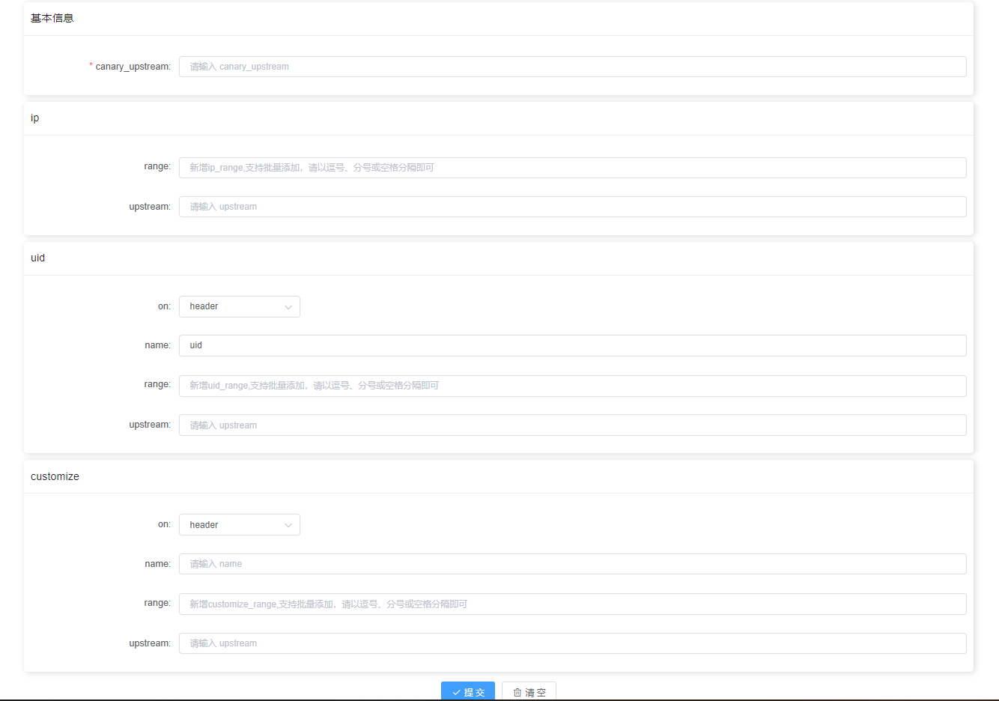

## canary金丝雀插件使用说明
基于kong[基于1.2.1版本]网关的灰度插件

canary的使用范围支持global、service、route

## canary插件原理


## canary配置界面



以下对配置参数进行详细说明
## canary_upstream
canary_upstream为必填项，设置默认转发的上游代理名称，如下所示：
```text
msgbox.upstream
```
## 灰度规则1：ip
### range
设置ip支持单个，多个，范围分段IP（满足CIDR notation规则），以下值都为合法
```text
10.0.2.2 
10.0.5.0/2
```
### upstream
非必填项，设置符合ip灰度规则时，转发的上游代理名称

## 灰度规则2：uid
### on
uid的参数从哪里获取；参数所处位置可选为：

header：请求头中获取uid参数 

cookie：从cookie中获取uid参数

args：从请求参数中获取uid参数

### name
uid在请求中的参数名
### range
设置uid的匹配规则，支持单个，多个，正则匹配（前缀、后缀等）
```text
1234
^UID%d+$ //匹配前缀
```
### upstream
非必填项，设置符合uid灰度规则时，转发的上游代理名称
## 灰度规则3：customize
自定义规则
### on
自定义的参数从哪里获取；参数所处位置可选为：

header：请求头中获取uid参数

cookie：从cookie中获取uid参数

args：从请求参数中获取uid参数

### name
请求中的参数名，例如：region(地域)
### range
设置匹配规则，支持单个，多个，正则匹配（前缀、后缀等）
```text
SD001
^BJ%d+$ //匹配前缀
```
### upstream
非必填项，设置符合该灰度规则时，转发的上游代理名称

## 规则优先级
默认情况下，未设置任何灰度规则时，默认灰度规则生效

优先级如下：

ip > uid > customize > default


